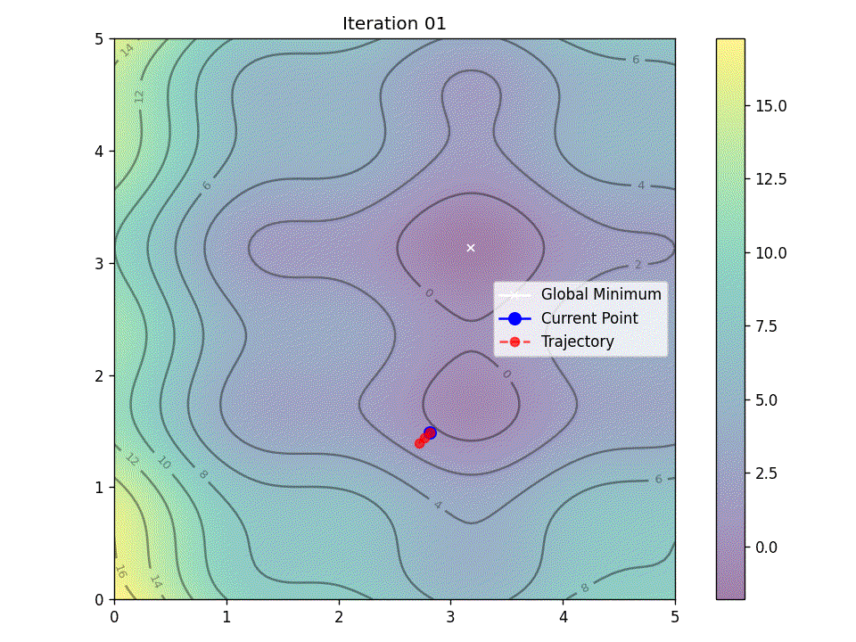
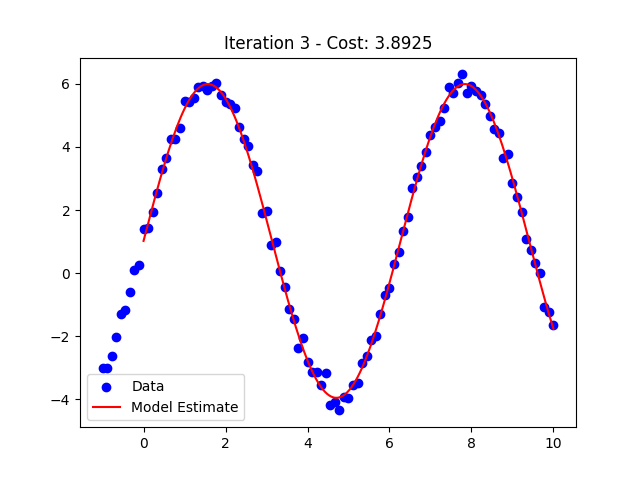

# Optimization Algorithms for Model Fitting

This repository contains implementations of three optimization algorithms widely used in machine learning and numerical analysis:

- **Levenberg–Marquardt (LM)**
- **Stochastic Gradient Descent (SGD)**
- **ADAM (Adaptive Moment Estimation)**

Each algorithm is implemented as a Python class with methods for optimizing model parameters, including optional real-time visualization of the fitting process.

---

## Features

- **LM (Levenberg–Marquardt):**  
  Ideal for non-linear least squares problems. Uses a numerical Jacobian computed via finite differences to update parameters and adaptively adjusts a damping factor.

- **SGD (Stochastic Gradient Descent):**  
  Implements mini-batch gradient descent with numerical gradient estimation via central differences. Suitable for various optimization tasks.

- **ADAM:**  
  Combines momentum and adaptive learning rates using bias‐corrected first and second moment estimates for parameter updates.

---

## Classes Overview

### LM (Levenberg–Marquardt)

**Constructor Parameters:**

- **model:** The model function taking \((\text{params},\, x)\) as inputs.
- **init\_guess:** Initial guess for the parameters.
- **max\_iter:** Maximum number of iterations (default: \(100\)).
- **tol:** Tolerance for convergence (default: \(1 \times 10^{-6}\)).
- **\(\lambda_{\text{init}}\):** Initial damping factor (default: \(1 \times 10^{-3}\)).

**Key Methods:**

- **numerical\_jacobian:** Computes the Jacobian matrix of residuals with respect to parameters using finite differences.
- **optimize:** Runs the LM algorithm, with support for optional real-time visualization.

### SGD (Stochastic Gradient Descent)

**Constructor Parameters:**

- **model:** Model function.
- **init\_params:** Initial parameter guess.
- **loss\_fn:** Loss function (e.g., mean squared error).
- **lr:** Learning rate (default: \(0.001\)).
- **max\_iter:** Maximum number of epochs (default: \(1000\)).
- **batch\_size:** Mini-batch size (default: \(20\)).
- **tol:** Tolerance for convergence (default: \(1 \times 10^{-6}\)).
- **\(h\):** Step size for numerical gradient estimation (default: \(1 \times 10^{-7}\)).
- **verbose:** If \(\text{True}\), prints progress information (default: \(\text{True}\)).

**Key Methods:**

- **numerical\_grad:** Approximates the gradient of the loss using central differences.
- **optimize:** Executes the SGD optimization with optional visualization.

### ADAM (Adaptive Moment Estimation)

**Constructor Parameters:**

- Same as SGD, plus:
  - **\(\beta_1\):** Exponential decay rate for the first moment estimates (default: \(0.9\)).
  - **\(\beta_2\):** Exponential decay rate for the second moment estimates (default: \(0.999\)).
  - **\(\epsilon\):** Small constant for numerical stability (default: \(1 \times 10^{-8}\)).

**Key Methods:**

- **numerical\_grad:** Similar to SGD’s numerical gradient computation.
- **optimize:** Runs the ADAM algorithm with real-time visualization optional.

---

## Global Minima Example

As you can see from the following evaluation—in the case of multiple local minima—the gradient‐based method struggles to find the global minimum of the function, while PSO is able to find it.

Global minimum:  
\[
f\!\left(\left[3.1818181818181817,\; 3.131313131313131\right]\right) = -1.8082706615747688
\]

### PSO

PSO found the best solution at:  
\[
f\!\left(\left[3.18496451,\; 3.1297101\right]\right) = -1.8083517596981689
\]

### SGD

SGD found the best solution at:  
\[
f\!\left(\left[3.18515538,\; 1.73879282\right]\right) = -0.9061231215300085
\]

### ADAM

ADAM found the best solution at:  
\[
f\!\left(\left[3.20975875,\; 1.75743348\right]\right) = -0.9000595521935848
\]

---

## Curve Fitting Example

Real Parameters:  
\[
\left[5.0,\; 1.0,\; 1.0\right]
\]

### LLM 

Estimated Parameters:  
\[
\left[4.98797197,\; 0.99907269,\; 0.9520247\right]
\]

### SGD 

Estimated Parameters:  
\[
\left[4.96197119,\; 1.00108708,\; 1.01482071\right]
\]

### ADAM 

Estimated Parameters:  
\[
\left[4.8944402,\; 1.00099646,\; 0.99991453\right]
\]
