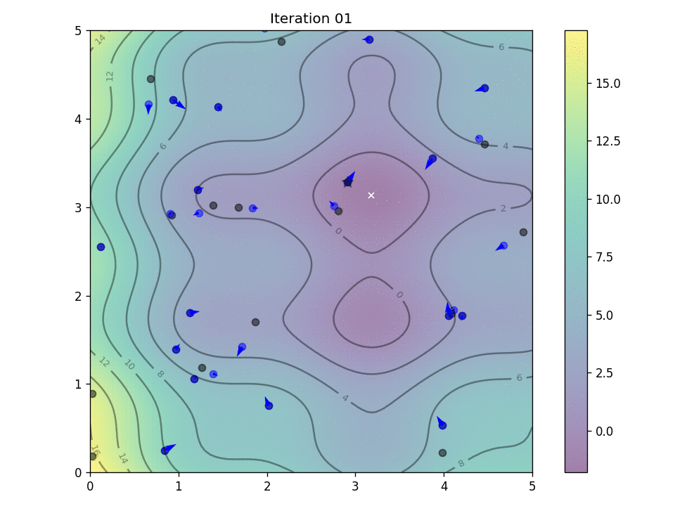

# Optimization Algorithms for Model Fitting

This repository contains implementations of optimization algorithms widely used in machine learning and numerical analysis:

- **Levenberg–Marquardt (LM)**
- **Stochastic Gradient Descent (SGD)**
- **ADAM (Adaptive Moment Estimation)**
- **PSO** (Particle Swarm Optimization)

Each algorithm is implemented as a Python class with methods for optimizing model parameters, including optional real-time visualization of the fitting process.

---

## Features

- **LM (Levenberg–Marquardt):**  
  Ideal for non-linear least squares problems. Uses a numerical Jacobian computed via finite differences to update parameters and adaptively adjusts a damping factor.

- **SGD (Stochastic Gradient Descent):**  
  Implements mini-batch gradient descent with numerical gradient estimation via central differences. Suitable for various optimization tasks.

- **ADAM:**  
  Combines momentum and adaptive learning rates using bias‐corrected first and second moment estimates for parameter updates.

- **PSO**
  Particle swarm optimization (PSO) is one of the bio-inspired algorithms and it is a simple one to search for an optimal solution in the solution space.

---

## Global Minima Example

As you can see from the following evaluation—in the case of multiple local minima—the gradient‐based method struggles to find the global minimum of the function, while PSO is able to find it.

Global minimum:
```math
\[
f\!\left(\left[3.1818181818181817,\; 3.131313131313131\right]\right) = -1.8082706615747688
\]
```
### PSO



PSO found the best solution at: 
```math
\[
f\!\left(\left[3.18496451,\; 3.1297101\right]\right) = -1.8083517596981689
\]
```
### SGD


SGD found the best solution at: 
\[
f\!\left(\left[3.18515538,\; 1.73879282\right]\right) = -0.9061231215300085
\]

### ADAM


ADAM found the best solution at:  
\[
f\!\left(\left[3.20975875,\; 1.75743348\right]\right) = -0.9000595521935848
\]

---

## Curve Fitting Example

Real Parameters:  
\[
\left[5.0,\; 1.0,\; 1.0\right]
\]

### LLM 


Estimated Parameters:  
\[
\left[4.98797197,\; 0.99907269,\; 0.9520247\right]
\]

### SGD 


Estimated Parameters:  
\[
\left[4.96197119,\; 1.00108708,\; 1.01482071\right]
\]

### ADAM 


Estimated Parameters:  
\[
\left[4.8944402,\; 1.00099646,\; 0.99991453\right]
\]

---

> **Note:** GitHub’s default Markdown renderer does not support LaTeX math. To view these expressions rendered as mathematical notation, consider using GitHub Pages with MathJax or converting these expressions to images.
